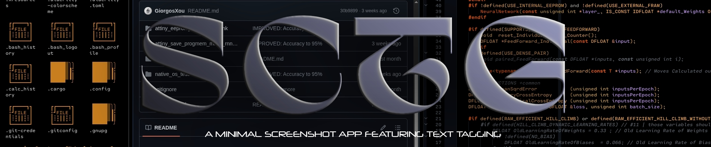
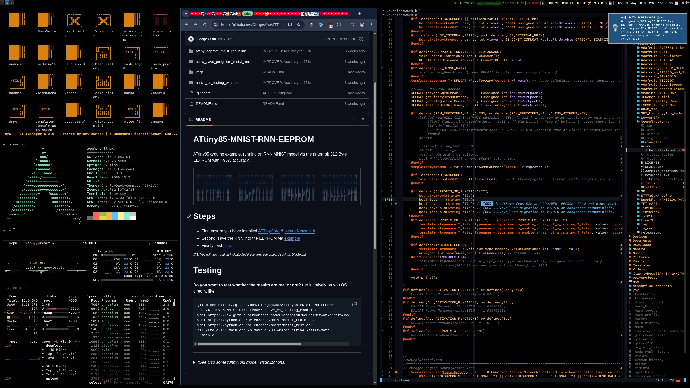

<p align="center">

</p>

---

## Intro

A minimal and lightweight [X11](https://en.wikipedia.org/wiki/X_Window_System) screenshot utility written in [C99](https://en.wikipedia.org/wiki/C99), featuring tagging support via the JPEG COM *(comment)* segment. It uses [portgui (luigi fork)](https://github.com/the-real-dill/portgui/pull/1) for its interface and serves as a partial C reimplementation of my original [python-based sctg](https://github.com/GiorgosXou/sctg).


## Installation
Ensure you  have installed `xclip` tool *(for copying into the clipboard)* and `libjpeg`.

```shell
gcc main.c -o sctg -lX11 -lXext -ljpeg $(pkg-config --cflags --libs gio-2.0)
mv ./sctg ~/.local/bin/sctg
```

- Change default key via: eg. `-D SCREENSHOT_KEY=XK_F2`
- Change default quality: eg. `-D QUALITY=90`


## Usage Informations
Once installed simply run `sctg <valid_path>`, then :

1. Screeshot via `SCREENSHOT_KEY` 
2. Screeshot + Crop\edit via `CTRL + SCREENSHOT_KEY` 
3. Screeshot + Store only into clipboard via `SHIFT + SCREENSHOT_KEY` 
4. Screeshot + Crop\edit + Store only into clipboard  `CTRL + SHIFT + SCREENSHOT_KEY` 

*(When cropping\editing you may press `t` to add additional "tags")*


## Ok, but why..

Because it solves a problem of mine, and that's the whole point. It helps me track informations way faster via things like:
```shell
exiftool -filename -Comment -r -if \
'$Comment =~ /memes/i and $Comment =~ /discord/i' \
~/Desktop/xou/multimedia/screenshots/sctg_2026-*
```
*(or `/instagram/i` `../user/i` ... just kidding! I ain't a [creep](https://www.youtube.com/watch?v=umnL7RbrTrM) lol)*

## Outro

Here's a *(slightly edited)* screenshot I took with it:

<p align="center">

</p>


<!-- 
SCTG-X11-Screenshot-Tool
A minimal & lightweight X11 screenshot-tool, with built-in tagging support via the JPEG COM (comment) section, written in C99.
-->

<!--
# Reminder:
  NOTE: bear -- gcc main.c -o main.o -lX11 -lXext -ljpeg $(pkg-config --cflags --libs gio-2.0) -std=c99 
  NOTE: bear -- gcc main.c -o main.o -lX11 -lXext -ljpeg $(pkg-config --cflags --libs gio-2.0) -std=c99 
  NOTE: bear -- gcc main.c -o main.o -lX11 -lXext -ljpeg $(pkg-config --cflags --libs gio-2.0) -std=c99 
-->
